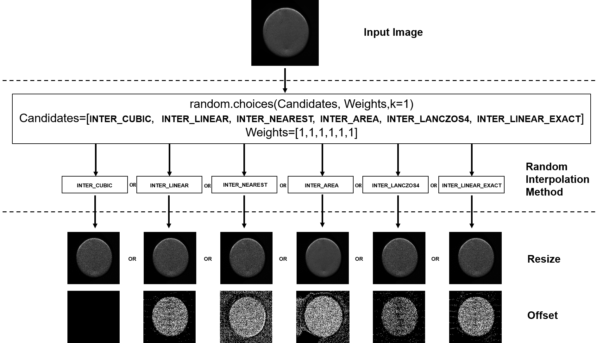

# Random Interpolation Resize: A Free Image Data Augmentation Method for Object Detection in Industry

## 简介
在工业机器视觉检测任务中，经常出现数据不足的情况，数据增强可以人为地将人类视觉的先验知识结合进来，扩展图像数据，提高模型的性能，已经成为模型的标准配置。然而，目前大部分的数据增强方法都是针对一般场景设计的，很少有专门针对工业目标检测的图像增强方法。

本仓库包含了一种新颖的图像数据增强方法，即随机插值调整（RIR），专门设计用于工业目标检测任务。我们改变了预处理中标准调整大小步骤的插值方法，从固定配置变为随机选择，以扩展图像数据，并提高模型的泛化和检测能力。

## 论文链接
- [Random Interpolation Resize: A Free Image Data Augmentation Method for Object
Detection in Industry](https://www.sciencedirect.com/science/article/pii/S0957417423008576)

## 中文解读链接
- [RIR中文解读](中文解读链接) [TODO: 如有需要，会在后面编写并更新]

## 视频教程链接
- [RIR 视频解读和二次创新方案]() [目前已有文字版PPT详细教程，TODO: 如有需要，会在后面编写并更新视频]

## 二次创新点梳理和代码实现（TODO）
- [二次创新方案]() [PPT教程的最后一页提供了部分二次创新方案，TODO: 如有需要，会在后面编写并更新代码]

## 引用格式
如果项目和文章对您有所帮助，请引用以下论文：

@article{WAN2023120355,
title = {Random Interpolation Resize: A free image data augmentation method for object detection in industry},
journal = {Expert Systems with Applications},
volume = {228},
pages = {120355},
year = {2023},
issn = {0957-4174},
doi = {https://doi.org/10.1016/j.eswa.2023.120355},
url = {https://www.sciencedirect.com/science/article/pii/S0957417423008576},
author = {Dahang Wan and Rongsheng Lu and Ting Xu and Siyuan Shen and Xianli Lang and Zhijie Ren},
keywords = {Data augmentation, Image interpolation, Object detection, Industry applications, Deep learning algorithm, Convolutional neural network},
}

例如：

Dahang Wan, Rongsheng Lu, Ting Xu, Siyuan Shen, Xianli Lang, Zhijie Ren,
Random Interpolation Resize: A free image data augmentation method for object detection in industry,
Expert Systems with Applications,
Volume 228,
2023,
120355,
ISSN 0957-4174,
https://doi.org/10.1016/j.eswa.2023.120355.
## 参考链接
- [整体框架使用代码：YOLOv5](https://github.com/ultralytics/yolov5)
- [YOLOv7](https://github.com/WongKinYiu/yolov7)
- [YOLOv8](https://github.com/ultralytics/ultralytics)
- [Albumentations 数据增强库](https://github.com/albumentations-team/albumentations)
## 结尾
感谢您对本项目的关注和支持。作者尽力提供最好的质量和服务，但仍然有很多需要改进之处。如果您发现任何问题或有任何建议，请告诉我。
另外，本项目目前由我个人维护，难免存在疏漏和错误。如果您发现了任何问题，欢迎提出建议和意见。

## 其他开源项目
其余开源项目陆续在整理发布，后续请查看作者主页进行下载
[主页](https://github.com/wandahangFY)

## 相关问题解答
1. README.md 文件添加 （已完成）  
2. 详细教程 （已更新YOLOv7和YOLOv8）
3. 项目环境配置（RIR数据增强是即插即用的,整个项目是YOLOv5-6.1版本，配置参考README-YOLOv5.md文件和requirements.txt）
4. 文件夹对应说明（与YOLOv5-6.1保持一致，未改变超参数）（TODO：详细说明 ）
5. 二次创新点梳理和代码实现（在RIR使用教程.pptx最后一页有详细说明）
6. 论文作图（期刊版权问题，不提供ppt源文件，见谅）：
   - 原理图，网络结构图，流程图：PPT （根据个人选择，也可以使用Visio，亿图，AI等）
   - 实验对比：Orgin（matlab,python,R,Excel都可以）